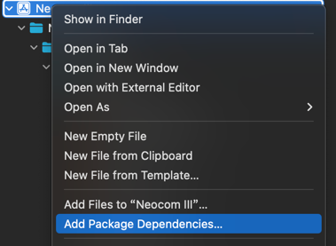
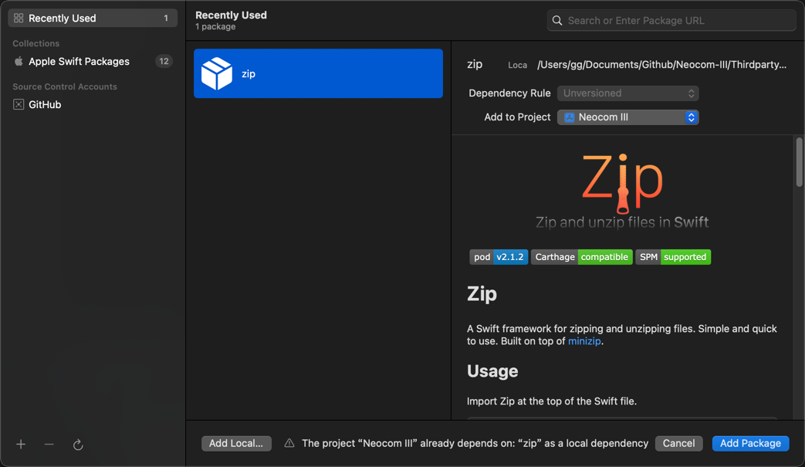
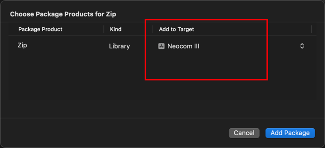

# 准备依赖

下载依赖，解压（也可以直接导入Thirdparty中的目录）：
- https://github.com/marmelroy/Zip

- 导入到项目中

# 准备数据库

通过 EveSDK 项目，将EVE SDE制作成数据库文件，以及整理好图标压缩包，将这资源放在以下位置

- 'Neocom-III/Neocom III/utils/icons_archive'
- 'Neocom-III/Neocom III/utils/SQLite'

# 编译运行

运行即可

# SDE 和 API 来源

- https://developers.eveonline.com/resource
- https://any-api.com/evetech_net/evetech_net/console